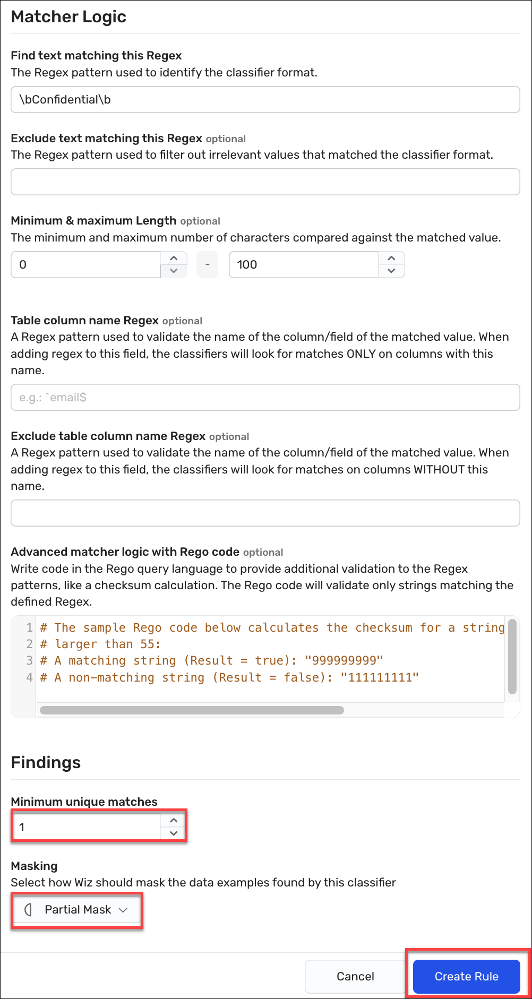

## Exercise: Create a control for data resources that are not compliance with the data classification labeling

Your manager wants you to ensure all files that stored with one of the required sensitivity label. Generate a control that alerts when a bucket contains a file that does not contain one of the required sensitivity levels.

**Note:** Wiz does not scan every resource on a bucket. Instead, it samples the files on a bucket. FoKeep this in mind. We will only be able to leverage the concepts in this lab based on a sample concept. However, we are leveraging multiple concepts to shine a light in the dark--it all helps.

In this exercise, we will a custom data classifier that scans files for any of the sensitivity levels. This rule should generate a data finding for any file that has one of the sensitivity levels. We are using a single rule to match on any of those conditions (and a new one -- 'Confidential - Internally Use Only'). It is a lession in first match evaluation within the rule, as well as how to build more complicated evaluations using a control. 

The tasks to perform are as follows:
* First, we will define the a data match rule that evaluates all three criteria.
* Second, we will define a control that looks for files that do no matchj on the rule.  
* Second, once the rule is completed we will rescan a bucket resource to see if our rules fire on any of its contents.
* Last, we will review our results and **TBWRITTENTHINTHERE***

### Expected Outcomes

Once the rules are defined and the bucket is rescanned, we will see some findings for the data classifier. 

### Task 1. Create the data classifier rule that matches on any of the supported classification levels
1. In the Wiz portal, scope resources down to the WizLabs project by seleting **WizLabs** from the Projects list.
2. Click **Policies > Data Classification Rules**, and then click the **Create New Data Classification Rule** button.
 <ins>Expected Result:</ins> The New Data Classification Rule page appears. 
3. Under Classification Type, select **Data match**.
4. In the Name box, enter a name for this rule using the following format *\<login-username\>-dspmlab-data-class-any\* (for example, odl_user_#####-dspmlab-data-class-any).
5. (Optional) In the Description box, enter a description for the rule.
 Use the guidance from above.
6. From the Data Type dropdown, select **Other**.  
As we are focused on proprietariy information, this rule does not match any known defintions, such as PHI or PII. As these types are used as filters in other pages, you should strive to keep them as accurate as possible.
7. (Optional) Under Framework categories, select the framework and category to which this rule should be aligned.
 Aligning to a compliance framework may be part of your orgnaization-specific policies and governance. You will need to select an existing or custom compliance framework and then align to the correct category, which in this case, is usually Data Security or a sensitive data tracking category.

8. From the Severity dropdown box, select **Medium**. We are picking a middle ground here an leveraing the more exact matches on Secret and Classified to indicate greater concern. 
 Severity of the data classifier is only part of the formula that is used to designate the severity of any related data finding. Remember that it is the number of unique occurrences.
9. Under Matcher Logic in the Find text matching this Regex box, enter <code>\b(?:Confidential - Internally Use Only|Confidential|Secret|Unclassified|)\b</code>.
 This classifier uses '|' to OR the matches; and we've ordered this rule to spefically match on the full string of 'Confidential - Internally Use Only' first. If 'Confidential' where first, it would match on all of the conditions. While this appears to have no effect in the finding results, that is not true. The masked sample will be based on the initial hit. 
10. In the Minimum unique matches box, enter **1**.
11. From the Masking list, select **Partial Mask**.

12. Click **Create rule** to save the rule in the Wiz tenant.
 <ins>Expected Result:</ins> A user-defined rule appears among the list of rules on the Data Classification Rules page. 

### Task 2. Define the control

1. In the Wiz portal, navigate to **Explorer > Security Graph**.
 <ins>Expected Result:</ins> The Security Graph page appears. 
2. Click on **FIND Cloud Resource...** and select **Bucket**.
3. Click + to the right of the bucket to add a condition and select **Data Finding**.
4. Click + to the right of the Data Finding and select **Classifer**, select **Equals** and then select the controld you defined in Task 1, such as odl_user_12345-dspmlab-data-classifications-any

Create the control, click **Save as control**
 <ins>Expected Result:</ins> The New Control page appears.

8. From the Severity dropdown box, select **High**. While the data sesntivity level is medium, this is a resoruce wide issue. 

4. In the Name box, enter a name for this rule using the following format *\<login-username\>-odl_user_12345-Missing Required Sensitivity Classification
\* (for example, odl_user_12345-Missing Required Sensitivity Classification
).
5. (Optional) In the Description box, enter a description for the rule.
 Use the guidance from above.

https://app.wiz.io/graph#~(view~'table~query~(type~(~'DATA_RESOURCE)~select~true~relationships~(~(type~(~(type~'HAS_DATA_FINDING))~negate~true~with~(type~(~'DATA_FINDING)~where~(dataClassifierId~(EQUALS~(~'CUSTOM-5e7ceb62-c881-4f58-af8b-5c07e9edac2f)))))~(type~(~(type~'HAS_DATA_STORE))~with~(type~(~'DATA_STORE)~select~true~where~(isStructured~(EQUALS~false)))))))

### Task 3. Scan the bucket to test your finding
1. In the Wiz portal, navigate to **Explorer > Security Graph**.
 <ins>Expected Result:</ins> The Security Graph page appears. 
2. Click on **FIND Cloud Resource...** and select **Bucket**.
3. Click the **+** to the right of that new node and select the **Name** property.
4. In the contains box, enter <code>s3-fileshare-rbm</code>.
5. Click on the resulting node to open the Details drawer.
6. At the top of the drawer, click the <code>&#x22EE;</code> in the upper right to open the More options menu and click **Rescan resource**.
 <ins>Expected Result:</ins> There will be no visual cue that the rescan started. If you try to start it again, you will receive an error message.

### Task 4. Verify the results of the data scan
1. In the Wiz portal, navigate to **Explorer > Security Graph**.
 <ins>Expected Result:</ins> The Security Graph page appears. 
2. Click on **FIND Cloud Resource...** and select **Bucket**.
3. Click the **+** to the right of that new node and select the **Name** property.
4. In the contains box, enter <code>s3-fileshare-rbm</code>.
5. Click on the resulting node to open the Details drawer.
6. On the Overview tab, scroll down to the Disk Scans section. Verify that the Data Scan has completed since you triggered the rescan. 
 If not, then wait longer. You will have to reopen the drawer to refresh the data pulled. 
 If it has refreshed, then click the **Data** drawer to see the findings and data analysis.
7. Under Has alerting Data Findings, scroll through the list of findings until you see a match for the rule that you defined. You may have to click **Load more** to see your results. 
 <ins>Expected Result:</ins> You find a match for the following files in the data findings. If you expand that finding:

# TBW 

