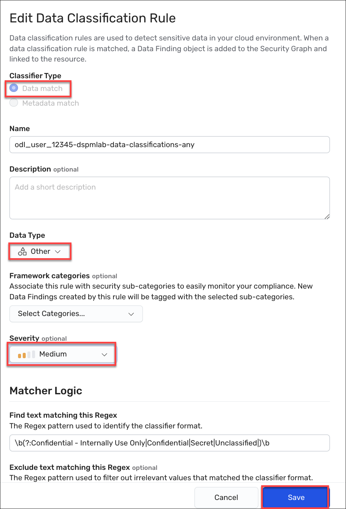

## Exercise: Create a control for data resources that are not compliance with the data classification labeling

Your manager wants you to ensure all files that stored with one of the required sensitivity label. Generate a control that alerts when a bucket contains a file that does not contain one of the required sensitivity levels.

**Note:** Wiz does not scan every resource on a bucket. Instead, it samples the files on a bucket. Keep this in mind. We will only be able to leverage the concepts in this lab based on a sample concept. However, we are leveraging multiple concepts to shine a light in the dark--it all helps.

In this exercise, we will a custom data classifier that scans files for any of the sensitivity levels. This rule should generate a data finding for any file that has one of the sensitivity levels. We are using a single rule to match on any of those conditions (and a new one -- 'Confidential - Internally Use Only'). It is a lesson in "first match" evaluation within the data classification rule, as well as how to build more complicated evaluations using a control. 

The tasks to perform are as follows:
* First, we will define a data match rule that evaluates all three criteria.
* Second, once the rule is completed, we will rescan a bucket resource to see if our rules fire on any of its contents.
* Third, we will define a control that looks for buckets that data on them but none of it matches the data match rule we defined.  
* Last, we will review our results to see whether the control finds any data stores that include data but that data i not tagged with the data finding we created.

### Expected Outcomes

Once the rules are defined and the bucket is rescanned, we will see some resources that . 

### Task 1. Create the data classifier rule that matches on any of the supported classification levels
1. In the Wiz portal, scope resources down to the WizLabs project by selecting **WizLabs** from the Projects list.
2. Click **Policies > Data Classification Rules**, and then click the **Create New Data Classification Rule** button.
 <ins>Expected Result:</ins> The New Data Classification Rule page appears. 
3. Under Classification Type, select **Data match**.
4. In the Name box, enter a name for this rule using the following format *\<login-username\>-dspmlab-data-class-any* (for example, odl_user_#####-dspmlab-data-class-any).
5. (Optional) In the Description box, enter a description for the rule.
 Use the guidance from above.
6. From the Data Type dropdown, select **Other**.  
As we are focused on proprietary information, this rule does not match any known definitions, such as PHI or PII. As these types are used as filters in other pages, you should strive to keep them as accurate as possible.
7. (Optional) Under Framework categories, select the framework and category to which this rule should be aligned.
 Aligning to a compliance framework may be part of your organization-specific policies and governance. You will need to select an existing or custom compliance framework and then align to the correct category, which in this case, is usually Data Security or a sensitive data tracking category.

8. From the Severity dropdown box, select **Medium**. We are picking a middle ground here an leveraging the more exact matches on Secret and Classified to indicate greater concern. 
 Severity of the data classifier is only part of the formula that is used to designate the severity of any related data finding. Remember that it is the number of unique occurrences.
9. Under Matcher Logic in the Find text matching this Regex box, enter <code>\b(?:Confidential - Internally Use Only|Confidential|Secret|Unclassified|)\b</code>.
 This classifier uses '|' to OR the matches; and we've ordered this rule to specifically match on the full string of 'Confidential - Internally Use Only' first. If 'Confidential' where first, it would match on all of the conditions. While this appears to have no effect in the finding results, that is not true. The masked sample will be based on the initial hit. 
10. In the Minimum unique matches box, enter **1**.
11. From the Masking list, select **Partial Mask**.
12. Click **Create rule** to save the rule in the Wiz tenant.
 <ins>Expected Result:</ins> A user-defined rule appears among the list of rules on the Data Classification Rules page. 

### Task 2. Scan the bucket to test your finding
1. In the Wiz portal, navigate to **Explorer > Security Graph**.
 <ins>Expected Result:</ins> The Security Graph page appears. 
2. Click on **FIND Cloud Resource...** and select **Bucket**.
3. Click the **+** to the right of that new node and select the **Name** property.
4. In the contains box, enter <code>s3-fileshare-rbm</code>.
5. Click on the resulting node to open the Details drawer.
6. At the top of the drawer, click the <code>&#x22EE;</code> in the upper right to open the More options menu and click **Rescan resource**.
 <ins>Expected Result:</ins> There will be no visual cue that the rescan started. If you try to start it again, you will receive an error message.

### Task 3. Define the control

1. In the Wiz portal, navigate to **Explorer > Security Graph**.
 <ins>Expected Result:</ins> The Security Graph page appears. 
2. Click on **FIND Cloud Resource...** and select **Bucket**.
3. Click **+** to the right of the bucket object to add a condition and select **Data Finding: that alerted on it**.
4. Click **+** to the right of the Data Finding and select **Classifier**, select **Equals**, and then select the control you defined in Task 1, such as *odl_user_12345-dspmlab-data-classifications-any*..
5. What we see now is all of the buckets where that finding fired. We want to see the opposite, so select the eye at the end of the data classifier clause and select **Negate Relation**.
 <ins>Expected Result:</ins> The negated clause reads THAT NOT Has Alerting Data Finding WHERE Classifier equals odl_user_12345-dspmlab-data-classifications-any. This change indicates that you want to see any bucket where this classifuer did not generate a finding. And that is good, but we are not scanning things like database for these finds of files. We know that by and large, we care about unstructured data, such as PDFs, Docx, and text files.
6. To narrow down to buckets that have unstructured data without the finding, let's add the following. Next to the Bucket node, click the **+** again, and select **Data Store that stored on it**.
7. Click **+** to the right of the Data Store object and select the Structured equals flag.
8. We just said that we don't want structured data, so let's set the value of that Structured equals flag to **False**.
 Let's consider this query now. We are finding buckets that have occurrences of unstructured data, but they do not have any data finding that matches our required classification levels. What does that mean? It means that we have found a bucket with files probably care about, but none of those files have been tagged using the data classification system our manager wants us to check for. So this is a good start. Now let's save this as a control so that we can get an issue generated every time this rule files, so we can see them at a resource level.

10. To create the control, click **Save as control** to the right of the query.
 <ins>Expected Result:</ins> The New Control page appears.
11. From the Issue Severity dropdown box, select **High**. While the data sensitivity level is medium, this is a resource wide issue. 
12. In the Name box, enter a name for this rule using the following format *\<login-username\>-Missing Required Sensitivity Classification
\* (for example, odl_user_12345-Missing Required Sensitivity Classification
13. (Optional) In the Description box, enter a description for the rule.
 We want to ensure that we are clearly stating the intention behind the rule. Enter the following description: "This control looks for any buckets that contain unstructured data, such as Word files, PDFs, and text files, that are not tagged with one of the required sensitive classification levels. The intention is to find the resources so we can remediate them before they become a problem. It also satisfies our compliance requirement to periodically review resources for proper tagging."
14. In the Recommendations box, enter a description of how to remediate any resources that have this issue. 
 It is best practice to provide guidance on how to resolve any resulting issues. For example, in our scenario, we can use "To resolve this issue, review all unstructured files on this bucket and ensure that they have the correct sensitivity classification tag setting. All files should be tagged as 'Secret', 'Confidential', or 'Unclassified'."
15. To save the control, click **Create Control**.
 <ins>Expected Result:</ins> The New Controls page closes and you return to the graph. 

### Task 4. Verify the results of the data scan
1. In the Wiz portal, navigate to **Policies > Controls**.
 <ins>Expected Result:</ins> The Controls page appears. 
2. Click on **All controls outside framework** and scroll down until you find the control you just defined.
3. Click on the  ***\<login-username\>-Missing Required Sensitivity Classification** control to open the control drawer page. 

4. To see which resources match the control, click the **View on graph** button.
 <ins>Expected Result:</ins> The Security Graph page appears with the query defined and the results appear in the table view.

**Note:** Assuming there are findings in the results list above, issues will also fire for this rule within ~24 hours. 

# END OF LAB

