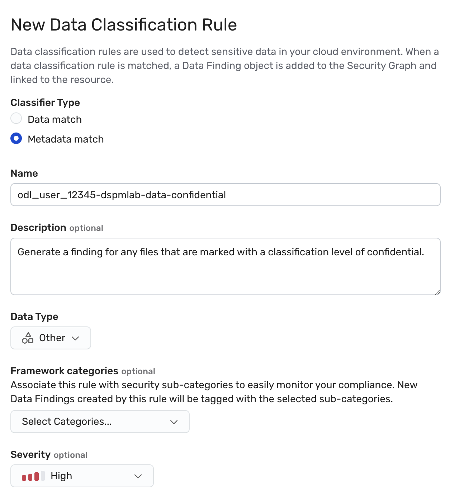
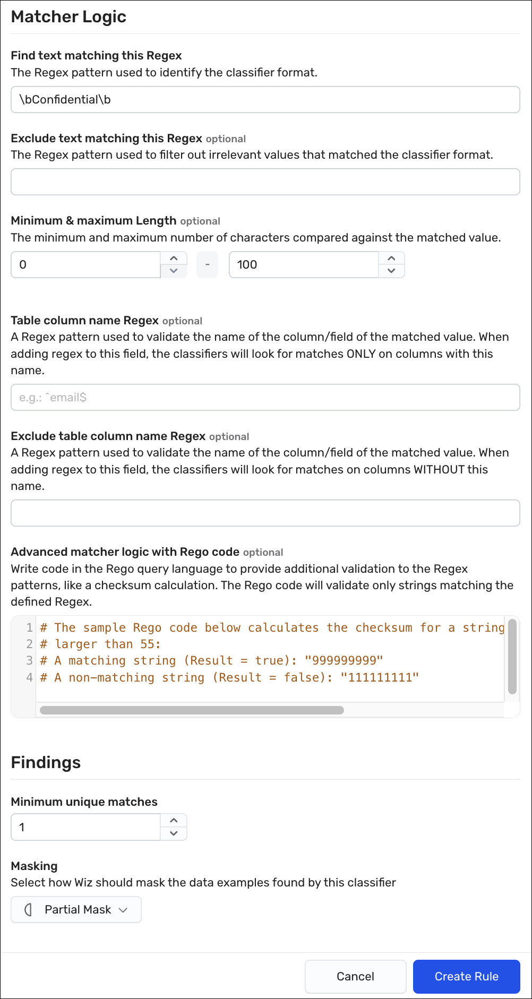

## Exercise: Create a custom data classifier

### Scope

In this exercise, we will three custom data classifiers to scan files for each of the sensitivity levels. These rules should generate data finding if such a file is detected. 
The tasks to perform are as follows:
* First, we will define the three data match rules. 
* Second, once the rules are completed, we will rescan a bucket resource to see if our rules fire on any of its contents.
* Last, we will verify our rules by reviewing the finding results. 

### Expected Outcomes

Once the rules are defined and the bucket is rescanned, we will see some findings for the data classifier. 

### Scenario Guidance
The following guidance should be used when defining these classifiers:

#### Secret Classification Rule
* For a rule name use *\<login-username\>-dspmlab-data-secret.
* Set the Description to "Generate a finding for any files that are marked with a classification level of secret."
* Under Matcher logic for the Find text matching this Regex box, enter <code>\bSecret\b</code>.
* For the rule that scans for the "Secret" classification level, we will define the classifier severity level as "Critical" to reflect the sensitve nature of the content.
* Set the Minimum unique matches to 1.
* From the Masking list, select Partial Mask.

#### Confidential Classification Rule
* For a rule name use *\<login-username\>-dspmlab-data-confidential.
* Set the Description to "Generate a finding for any files that are marked with a classification level of confidential."
* Under Matcher logic for the Find text matching this Regex box, enter <code>\bConfidential\b</code>.
* For the rule that scans for the "Confidential" classification level, we will define the classifier severity level as "High" to reflect the sensitive nature of the content.
* Set the Minimum unique matches to 1.
* From the Masking list, select Partial Mask.

#### Unclassified Classification Rule
* For a rule name use *\<login-username\>-dspmlab-data-unclassified.
* Set the Description to "Generate a finding for any files that are marked with a classification level of unclassified."
* Under Matcher logic for the Find text matching this Regex box, enter <code>\bUnclassified\b</code>.
* For the rule that scans for the "Unclassified" classification level, we will define the classifier severity level as "Info" to reflect the nature of the content.
* Set the Minimum unique matches to 1.
* From the Masking list, select Partial Mask.

### Task 1. For each rule, follow these steps to create the data classifier rule
1. In the Wiz portal, scope resources down to the WizLabs project by seleting **WizLabs** from the Projects list.
2. Click **Policies > Data Classification Rules**, and then click the **Create New Data Classification Rule** button.
 <ins>Expeted Result:</ins> The New Data Classification Rule page appears. 
3. Under Classification Type, select **Data match**.
4. In the Name box, enter a name for this rule using the following format *\<login-username\>-dspmlab-data-\<classification-level\>* (for example, odl_user_#####-dspmlab-data-classification-confidential).
5. (Optional) In the Description box, enter a description for the rule.
 Use the guidance from above.
6. From the Data Type dropdown , select **Other**.  
As we are focused on proprietariy information, this rule does not match any known defintions, such as PHI or PII. As these types are used as filters in other pages, you should strive to keep them as accurate as possible.
7. (Optional) Under Framework categories, select the framework and category to which this rule should be aligned.
 Aligning to a compliance framework may be part of your orgnaization-specific policies and governance. You will need to select an existing or custom compliance framework and then align to the correct category, which in this case, is usually Data Security or a sensitive data tracking category.

8. From the Severity dropdown box, select based on guidance above.
 Severity of the data classifier is only part of the formula that is used to designate the sevrity of any relatred data finding. Remember that it is the number of unique occurences.
9. Under Matcher Logic in the Find text matching this Regex box, enter the recommended code as descrived above. 
10. In the Minimum unique matches box, enter **1**.
11. From the Masking list, select **Partial Mask**.

12. Click **Create rule** to save the rule in the Wiz tenant.
 <ins>Expeted Result:</ins> A user-defined rule appears among the list of rules on the Data Classification Rules page. 

### Task 2. Scan the bucket to test your finding
1. In the Wiz portal, navigate to **Explorer > Security Graph**.
 <ins>Expeted Result:</ins> The Security Graph page appears. 
2. Click on **FIND Cloud Resouce...** and select **Bucket**.
3. Click the **+** to the right of that new node and select the **Name** property.
4. In the contains box, enter <code>s3-fileshare-rbm</code>.
5. Click on the resulting node to open the Details drawer.
6. At the top of the drawer, click the <code>&#x22EE;</code> in the upper right to open the More options menu and click **Rescan resource**.
 <ins>Expeted Result:</ins> There will be no visual cue that the rescan started. If you try to start it again, you will recieve an error message.

### Task 3. Verify the results of the data scan
1. In the Wiz portal, navigate to **Explorer > Security Graph**.
 <ins>Expeted Result:</ins> The Security Graph page appears. 
2. Click on **FIND Cloud Resouce...** and select **Bucket**.
3. Click the **+** to the right of that new node and select the **Name** property.
4. In the contains box, enter <code>s3-fileshare-rbm</code>.
5. Click on the resulting node to open the Details drawer.
6. On the Overview tab, scroll down to the Disk Scans section. Verify that the Data Scan has completed since you triggered the rescan. 
 If not, then wait longer. You will have to reopen the drawer to refresh the data pulled. 
 If it has refreshed, then click the **Data** drawer to see the findings and data analysis.
7. Under Has alerting Data Findings, scroll through the list of findings until you see a match for the rule that you defined. You may have to click **Load more** to see your results. 
 <ins>Expeted Result:</ins> You find a match for the following files in the data findings. If you expand that finding:

* **Unclassified**. *rfp_request.docx* and *response_plan.docx*
* **Classified**. *Archive.zip->faq-check.txt*, *Archive/bizplan.DOCX*, *Archive/faq-check.txt*,
*bizplan_3.docx*,*deployment_plan.docx*, and *faq-check.txt*.
* **Secret**. *supplies.docx*.

