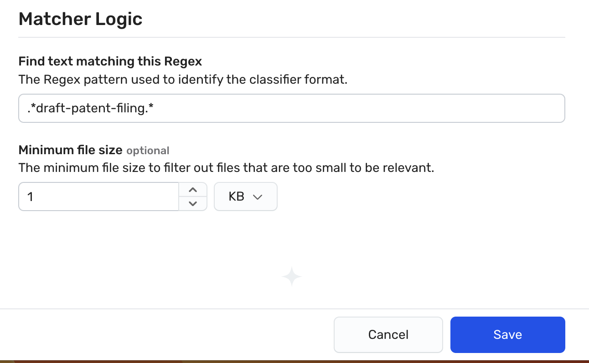

## Exercise: Create a metadata classifier

### Scope

In this exercise, we will create a custom metadata classifier that finds any files with "draft-patent-filing" in the title. The rule should generate data finding if such a file is detected. 

* First, we will define the classifier severity level as "Critical" to reflect the sensitve nature of the content. 
* Second, once this rule is completed, we will rescan a bucket resource to see if our rule fires on any of its contents.

### Expected Outcomes

Once the rule is defined and the bucket is rescanned, we will see some findings for the metadata classifier. 

### Task 1. Create the metadata classifier rule

1. In the Wiz portal, scope resources down to the WizLabs project by seleting **WizLabs** from the Projects list.
2. Click **Policies > Data Classification Rules**, and then click the **Create New Data Classification Rule** button.
 <ins>Expeted Result:</ins> The New Data Classification Rule page appears. 
3. Under Classification Type, select **Metadata match**.
4. In the Name box, enter a name for this rule using the following format *Other/<login-username>-dspmlab-meta* (for example, Other/odl_user_#####-dspmlab-meta).
 **Tip:** A useful convention for being able to understanding finding types at a glance on resources is to incldue the Data Type as a prefix to the rule. 
5. (Optional) In the Description box, enter a description for the rule.
 This field is useful for providing context for other users. While not necessary for this lab, it is best practice to state the purpose of the rule and use cases that it is expected to address. For example, "Identify working patent documents that are not submitted or granted. The expectation is to prevent any accidental public exposure of this material prior to patent submission when we can lock in the timestamp for submission. Expected to scan Word, PDF, and text file titles with the required title string 'draft-patent-filing' anywhere in the title of the file."
6. From the Data Type dropdown , select **Other**.  
As we are focused on proprietariy information, this rule does not match any known defintions, such as PHI or PII. As these types are used as filters in other pages, you should strive to keep them as accurate as possible.
7. (Optional) Under Framework categories, select the framework and category to which this rule should be aligned.
  Aligning to a compliance framework may be part of your orgnaization-specific policies and governance. You will need to select an existing or custom compliance framework and then align to the correct category, which in this case, is usually Data Security or a sensitive data tracking category.

8. From the Severity dropdown box, select **Critical**.
 Severity of the data classifier is only part of the formula that is used to designate the sevrity of any relatred data finding. Remember that it is the number of unique occurences.
9. Under Matcher Logic in the Find text matching this Regex box, enter **\bdraft-patent-filing\b**, which looks for the string 'draft-patent-filing' anywhere in the title of a file.
 In this regular expression, \b is a word boundary anchor that ensures "draft-patent-filing" is a whole word and not part of another word. So, it will match the exact string "draft-patent-filing" in a filename.
 **Tip:** You can enter a few file name examples in the Text Text box, with the string appearing in various places within the filename, and click Test Logic to make sure that it matches as you expect. It is best practice to validate the RegEx syntax before deploying it. When using https://regex101.com/, select the Golang flavor. If you are struggling with correct syntax, ChatGPT is adept at generating the text. You just need to be fairly non-specific in the flavor you want. For example, 'Write a regular expression to check for "draft-patent-filing" a filename' will generate the expression used above. 
10. In the Minimum file size box, enter **12** and select **KB** in the Bytes drop down. 
 In this example, we consider the size of a blank Word file as the minimum file size, which is about 12k. Wiz recommends that you define a minimum file size to reduce the likelihood of false positives.

11. Click **Create rule** to save the rule in the Wiz tenant.
 <ins>Expeted Result:</ins> A user-defined rule appears among the list of rules on the Data Classification Rules page. 

### Task 2. Scan the bucket to test your finding
1. Navigate to Explorer > Security Graph.
2. Click on FIND Cloud Resouce.... and select **Bucket**.
3. Click the **+** to the right of that new node and select the **Name** property.
4. In the contains box, enter <code>s3-fileshare-rbm</code>.
5. Click on the resulting node to open the Details drawer.
6. At the top of the drawer, click the &U+22EE; in the upper right to open the More options menu and click **Rescan resource**.
