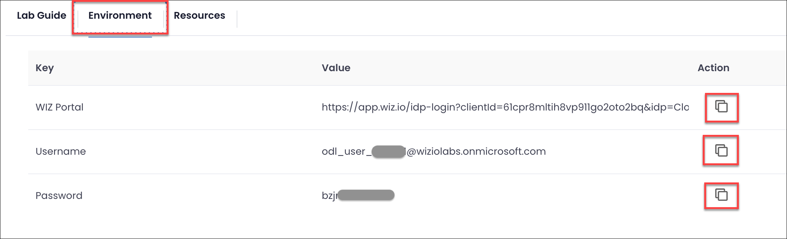
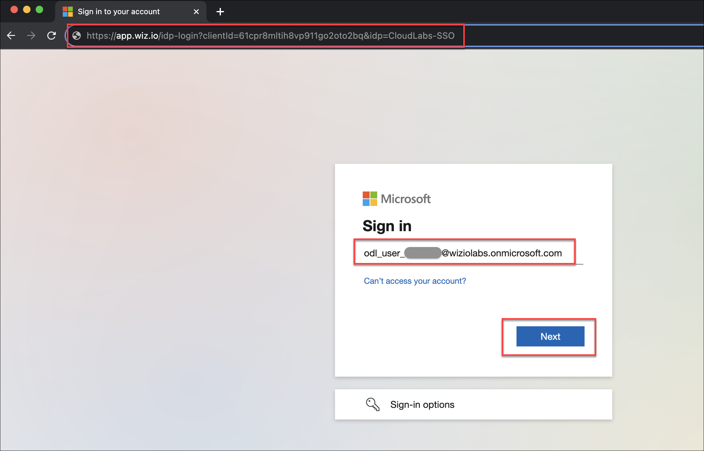
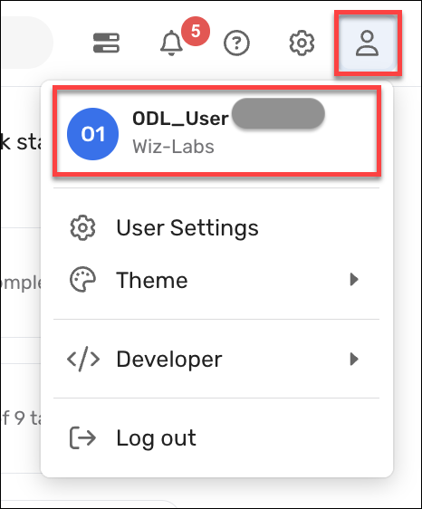

# Accessing your lab environment
___
 
In this lab, you will be given access to the Wiz-Labs Wiz tenant, where you will perform the exercises. 

 

1. To access the the tenant, retrieve the credentials in the **Environment** tab.

   

       
        

        
1. Open a new Private/Incognito session in your browser, paste the WIZ Portal url, then use the Username and Password.

    

       
        

        
1. Once inside the Wiz tenant, ensure you are logged in with the correct user.

    

       
        

1. Proceed to the **Next** page.
